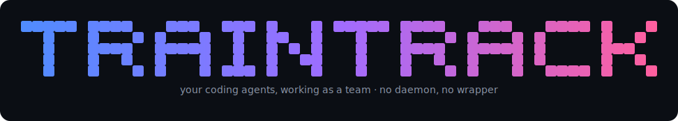

<p align="center">
  
</p>

<p align="center">
  <a href="https://www.npmjs.com/package/traintrack"></a>
  <a href="https://github.com/OKKHALIL3/traintrack/actions/workflows/ci.yml"></a>
  <a href="LICENSE"></a>
</p>

<p align="center">
  <b>Your coding agents, working as a team — in the terminals you already use.</b><br>
  Run <code>claude</code> and <code>codex</code> like you always do. After one <code>traintrack setup</code>, every session auto-joins a shared team: they see each other and talk, or one becomes a foreman that spawns the rest.
</p>

<p align="center">
  <code>npm i -g traintrack</code> · <code>traintrack setup</code> · <b>works with 10 agents</b> · Claude Code &amp; Codex beta · the rest alpha
</p>

<p align="center">
  <a href="https://traintrack.dev/" target="_blank" rel="noopener"><b>🌐 Website &amp; docs</b></a>
</p>

<p align="center">
  <i>No daemon · no wrapper command · no new app · just a SQLite file at your repo root.</i>
</p>

> [!WARNING]
> **Alpha.** traintrack is brand new and moving fast — commands, config formats, and the wire protocol can change between versions. Claude Code & Codex are live-verified; expect rough edges, and pin a version if you depend on it.

---

## Why traintrack is different

There are many ways to run several agents at once. traintrack is the one that disappears into your existing setup:

- **No wrapper, no relaunch.** You don't start agents *through* traintrack. Set up once, and your normal `claude` / `codex` sessions — however you launch them, even from your IDE's terminal — are already on the team. Nothing to remember at launch time.
- **Both modes in one install.** A leaderless **peer mesh** (sessions you open by hand discover + message each other) *and* a **foreman** that spawns headless workers into isolated git worktrees. Most tools do one or the other; traintrack does both, and the peer→lead transition is seamless.
- **Zero infrastructure.** No background daemon, no tmux, no cloud relay, no Electron app. The message bus is a SQLite file at your git repo root; install is a single `npm i -g`.
- **Native tools, not a prompt blob.** Agents get real MCP tools — `list_team`, `send_message`, `spawn_worker`, `await_results` — not a wall of injected instructions.

---

## Install

```bash
npm install -g traintrack
traintrack setup
```

> macOS & Linux. (traintrack drives POSIX agent CLIs; Windows isn't supported yet.)

`traintrack setup` detects which agent CLIs you actually have — **Claude Code, Codex, Cursor, OpenCode, Windsurf, Cline, Kiro, Zed, Continue, and GitHub Copilot CLI** — lets you pick, and wires each one up: its MCP server, a team-awareness note, and the `/team` command (in that host's own format, where the host supports user commands — Copilot CLI gets MCP + awareness only):

```
  › ◉ Claude Code  found 'claude' on PATH
    ◉ Codex        found 'codex' on PATH
    ◉ Cursor       found 'cursor' on PATH
    ◉ Windsurf     found '.codeium/windsurf'
    ◉ … 10 agents total
  ↑/↓ move · space toggle · a all/none · enter confirm · esc cancel
```

For each tool it (a) **registers the MCP server** in that tool's config and (b) **injects a short team-awareness note** into its instructions file. From then on you just launch your CLI normally. It's idempotent (safe to re-run), and `traintrack setup --uninstall` reverses it cleanly.

> Installs the `traintrack` command globally.

---

## Try it

### Mesh: open a few sessions, watch them connect

In one project, open two or three `claude` / `codex` sessions the way you always do (any subdirectory is fine — no special command). Then:

```bash
traintrack team          # see everyone on this project's team
```
```
Team channel: /your/repo/.traintrack/channel.db
  - claude-3f9a  (claude, role: lead, live, active)
  - codex-7c12   (codex,  role: lead, live, active)
```

Tell one session: *"send a message to `codex-7c12`: what are you working on?"* — the other surfaces it on its next turn (a `📨 1 unread` nudge), reads it with `check_messages`, and replies.

### Lead: blabber, get a team

In one session:

> "Build a CSV parser, a test suite for it, and a short README — split it up."

It proposes which worker takes which part, then on your OK spawns headless workers, collects their results, and hands you the finished work.

---

## Commands

| Command | What it does |
| --- | --- |
| `traintrack setup` | Detect + wire your agent CLIs (interactive). |
| `traintrack team` | Show this project's team (handles, agent, role, online status). |
| `traintrack inbox --handle <h>` | Print unread messages for a handle. |
| `traintrack join --handle <h> --role <r> [--agent claude\|codex]` | Run a headless auto-responding member that joins the team. |
| `traintrack init` | Create the `.traintrack/` channel for the current project. |
| `traintrack worker --agent <a> --role <r> --handle <h>` | Run a single headless worker bound to the channel. |

**`setup` flags:** `--all`, `--yes`, `--dry-run`, `--tools-only`, `--uninstall`, `--home <path>`.
**Channel selection (any command):** `--channel <path>`, or `--room <name>` for a shared room across projects (`~/.traintrack/rooms/<name>.db`). The default is your **git repo root** (`<repo>/.traintrack/channel.db`).

### The coordination tools your agent gets

`list_team` · `check_messages` · `send_message` · `spawn_worker` · `delegate_task` · `await_results` · `join_team`

---

## How it works

- **The channel is a SQLite file** (WAL) resolved at the **git repo root**, so every session opened in a project shares one team automatically. `--room` gives a shared cross-project bus. It holds your team's messages, tasks, and results — add `.traintrack/` to your `.gitignore` so it doesn't get committed.
- **Auto-presence:** each session's MCP server registers itself as a live member on startup and flips to offline when it ends — that's how teammates appear with zero setup.
- **Auto-receive:** spawned **headless workers** truly auto-respond (they run a drain→turn→reply loop). Hand-driven sessions can't be interrupted mid-task (a CLI limit), so they pick up messages at their next turn — every tool result carries a `📨 N unread` nudge so nothing is missed.
- **Spawning** = `git worktree add` + a child process, so each worker has an isolated tree and its own provider session.
- **No daemon, no server, no telemetry.** It's a library + an MCP server + a CLI.

---

## Drive it from chat — `/team`

After `setup`, every agent gets a `/team` command (in that host's own command format):

```
/team                     who's online + what each agent is doing
/team spawn <task>        spin up a worker for a task
/team delegate <task>     split a task across the team, then collect
/team sync                collect everyone's results
/team send <handle> ...   message a teammate
/team check               read your inbox
/team help
```

## Supported CLIs

`traintrack setup` wires the **MCP server + a team-awareness note + the `/team` command** into each agent it finds — in that host's own config/command format, with paths sourced from each host's official docs.

| CLI | Mesh + `/team` | Headless worker | Maturity |
| --- | --- | --- | --- |
| Claude Code | ✅ | ✅ | **beta** · live-verified |
| Codex | ✅ | ✅ | **beta** · live-verified |
| Cursor | ✅ | ⏳ | alpha |
| OpenCode | ✅ | ⏳ | alpha |
| Windsurf | ✅ | ⏳ | alpha |
| Cline | ✅ | ⏳ | alpha |
| Kiro | ✅ | ⏳ | alpha |
| Zed | ✅ | ⏳ | alpha |
| Continue | ✅ | ⏳ | alpha |
| GitHub Copilot CLI | ✅ MCP only | ⏳ | alpha |

- **beta** (Claude Code, Codex) — the spawn → work → collect path is live-verified end-to-end with real agents (`scripts/verify-*.mjs`).
- **alpha** (everyone else) — wired per the host's official MCP + command docs and proven to install/uninstall cleanly (`scripts/verify-agents.mjs`), but not yet tested live. Community verification welcome.
- **Headless worker** (a lead can `spawn_worker` it): Claude Code + Codex today; the rest are on the roadmap. Copilot CLI has no user-command surface, so it gets MCP + awareness (no `/team`).

---

## Manual setup (advanced)

If you'd rather not run the wizard, register the MCP server yourself. Resolve the absolute path with `node -e "console.log(require.resolve('traintrack/dist/mcp-server.js'))"`.

- **Claude Code** — add to `~/.claude.json`:
  ```json
  { "mcpServers": { "traintrack": { "command": "node", "args": ["<abs>/dist/mcp-server.js"], "env": { "TRAINTRACK_AGENT": "claude" } } } }
  ```
- **Codex** — add to `~/.codex/config.toml`:
  ```toml
  [mcp_servers.traintrack]
  command = "node"
  args = ["<abs>/dist/mcp-server.js"]
  env = { TRAINTRACK_AGENT = "codex" }
  ```

(Setup also writes a short awareness note into each tool's instructions file — see `traintrack setup --dry-run` for exactly what it would change.)

---

## Status

Two tiers of maturity:

- **Claude Code + Codex — beta.** The engine (spawn → work → collect, multi-round delegation, live members, the peer mesh, the `/team` command, and the one-command installer) is built and **live-verified with real `claude`/`codex` agents** — see `scripts/verify-*.mjs` and [`docs/ARCHITECTURE.md`](docs/ARCHITECTURE.md).
- **Cursor, OpenCode, Windsurf, Cline, Kiro, Zed, Continue, Copilot — alpha.** `setup` wires each per its official MCP + command docs (proven to install/uninstall cleanly via `scripts/verify-agents.mjs`); they join the mesh and get `/team`, but they're not yet live-verified and headless-worker spawning is next.

Things will change under you while it's early.

## License

[Apache-2.0](LICENSE) · © 2026 traintrack
